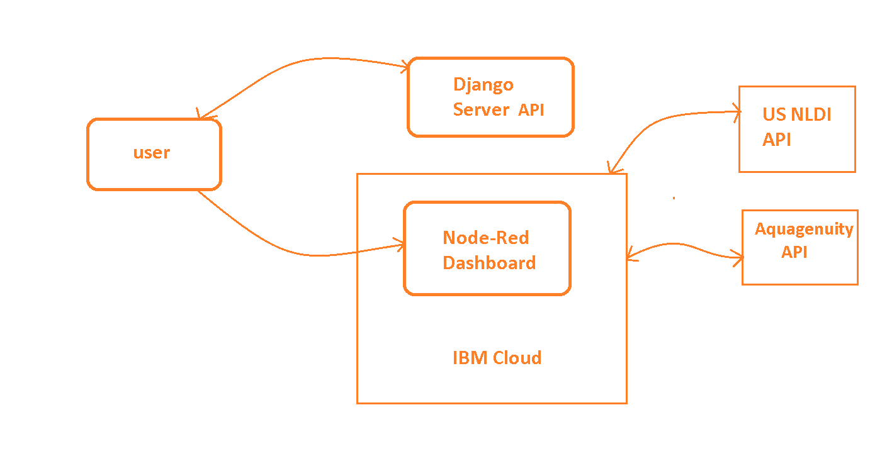
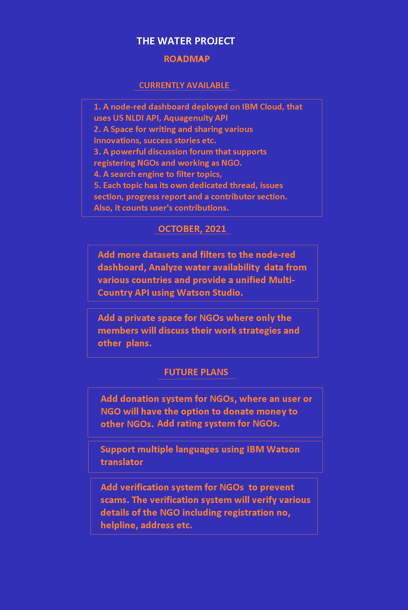

# The Water Project

The Water Project is a web app that provides a platform to access data related to water crisis, along with a powerful discussion forum to help people work together. The discussion forum is designed to let people raise their problems in their area, so that others can give suggestions or even start working to fix the problem. People can create Progress Report to track every improvements, create issues under that problem to break it into smaller problems. In simple words, it takes your local problems to the global level.

## Contents

- [The Water Project](#the-water-project)
  - [Contents](#contents)
  - [Short description](#short-description)
    - [What's the problem?](#whats-the-problem)
    - [How can technology help?](#how-can-technology-help)
    - [The idea](#the-idea)
  <!-- - [Demo video](#demo-video) -->
  - [The architecture](#the-architecture)
  - [Long description](#long-description)
  - [Demos](#demos)
  - [Project roadmap](#project-roadmap)
  - [Getting started](#getting-started)
  - [Authors](#authors)
  - [License](#license)


## Short Desciption

### What's the problem?
Unfortunately people who are hit by the water crisis the most, i.e. those who live in rural areas, don't have direct access to smart phones or even internet(in many places). As a result, they can't use the power of internet to share their problems and get help. Specially, where the water sources are very less in number, if even one of them gets polluted, the crisis worsens. And in that situation, what they need the most is help from others, specially those who know how to tackle those kind of problems. Here they rely completely on NGOs, activists or common people who work selflessly to help people. But again, its not always the case that, they know the proper solution or if they have one, there are always chances of better ideas, better solutions from someone living far away, may be in another country. 

Now, someone, in a different part of the world, may have a better solution to that problem. But there is no way for him to share his solutions with them as he/she doesn't even know about the problem. So, all they need a common platform to ask for help or to share their ideas.

### How can technology help?
A common platfrom to post about the difficulties/challenges and let others give ideas/solutions, can effectively solve the problems. 

### The idea
Although the amount of people not having proper internet access, are huge in number, unfortunately we as developers can't provide them the internet access. What we can do is to support those who work on those areas. With that in mind our idea has three main components -
- **Problem :** This section is to let the users access different types of data(like water basin, water flowlines, water score in an area) so that they can identify the problems in different areas.
- **Solution :** This is the blogs part. The goal is to provide the users a way to share their innovations/innovative ideas/success stories with the rest of the world irrespective of a particular problem (i.e. apart from the discussion forum). 
- **Discussion :** This is the main component. Here people can post problems of their local area, create issues to break the problem into smaller pieces for better analysis, create a Progress Report to track each improvement, set goals, add tasks to do, and discuss possible solutions. A detailed post along with proper address gives nearby people or NGOs a chance to work on that problem physically.

<!-- ## Demo Video -->
<!-- TODO -->

## The architecture


## Long description

[Long Description](./docs/DESCRIPTION.md)

## Demos
[All demos](./docs/DEMOS.md)

## Project roadmap


## Getting started
### Pre-requisite :
- Install [node.js](https://nodejs.org/en/)
- Install [python3](https://www.python.org/downloads/)
- Install yarn 

```bash
npm install --global yarn
```

### Creating a virtual enviornment
To create a virtual enviornment run the following commands - 
```bash
cd server/
python -m venv venv
```
**Note: The above command is for windows. In linux you have to write `python3` instead of python**.

This will create a virtual enviornment named `venv`. While creating virtual enviornment, make sure you named it as `venv`. Git will automatically ignore it.

### Activate the virtual environment
Before running any other command, first activate the virtual environment. For windows, run `venv/Scripts/activate` on the terminal, `source venv/bin/activate` for the rest of others. 

### Install python dependencies 
Run the following command to install all python package requirements - 
```bash
pip install -r requirements.txt
```
**Note :** If you face some permission issues, try the following -
- Go to server/venv/pyvenv.cfg file
- Change `include-system-site-packages = false` to `include-system-site-packages = true`
- Then run the following
```bash
pip install -r requirements.txt --user
```

Now first run the server
### Run the server
Run `cd server/` and then `python manage.py runserver` and wait till the server starts.

### Run the client
**Install npm dependencies**

Move to the client directory
```bash
cd client/
yarn
```
Run the `yarn start` or `npm start` command on the terminal. Now visit [127.0.0.1:3000](127.0.0.1:3000).


## Authors
- Subhradeep Chakraborty ( [Subhra264](https://github.com/Subhra264) )
- Abhradeep Chakraborty ( [Abhra303](https://github.com/Abhra303))

## License
This project is licensed under the Apache 2 License - see the [LICENSE](./LICENSE) file for details.